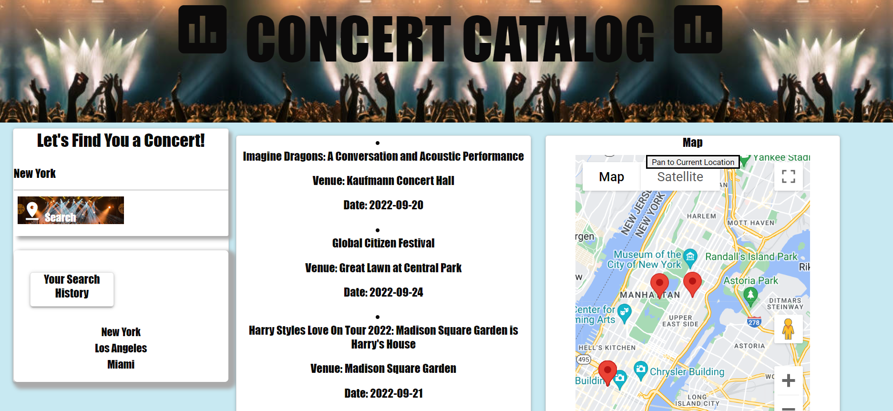

# java-near-me

---

The goal of Project 1 was to work together with our group members to create an interactive real-world front-end web application. Click to access our group's project, Concert Catalog, [here]().

## Description 

---

Concert Catalog is an interactive web application that allows users to search for concerts near the city they enter into the search bar. When a user opens up the application, they have the option of panning to their current location on the Google Map on the right side of the page. If they click "pan to current location", their current location loads on the map with a geolocation feature. Whether the user chooses to use this feature or not, next they navigate to the left side of the page, type in a city name, and click the search button.  Once the user clicks the search button, a fetch request is called to the Ticketmaster API to find concerts near that city name. This allows users to find a list of concerts in the city of their choosing. A for loop is run as well to find ten concerts from the data object of concert results. The user then sees these ten concert results displayed on the webpage. The user will see the name of the concert, the name of the venue, and the concert date. The latitude and longitude of these concert venues is used and passed to the Google Maps API fetch request. Markers are also created to dictate where the venues are on the map. This allows the user to see the concert venue results represented on the map on the right side of the page. If the user hovers their mouse above one of the markers, the venue name appears. If there are multiple concerts that have the same venue, just one marker is created for that venue on the map to avoid redundancy. Lastly, when the search button is clicked, the city name entered by the user is saved to local storage and then displayed in the search history box on the left side of the page. 

### Technologies

---

Our project was created with:

- CSS
- HTML
- JavaScript
- Bootstrap
- Materialize CSS
- Google Fonts
- Ticketmaster API
- Google Maps API

#### Screenshot

---

This image displays the Concert Catalog web application after a user searched for concerts near New York. 

##### Roadmap

---

In future releases of Concert Catalog, we plan to add the following:

- A feature that allows users to look up concerts in a state, not just a specific city
- A filter to search for more specific results including the type of concert a user would like to attend (i.e. rock, pop, classical, etc.)
- An image to go along with the concert information displayed on the webpage 

###### Authors

---

This web application was built by Ariel Miller, Gabrielle Castillo, Cory Kim, and Caitlin O'Reilly.